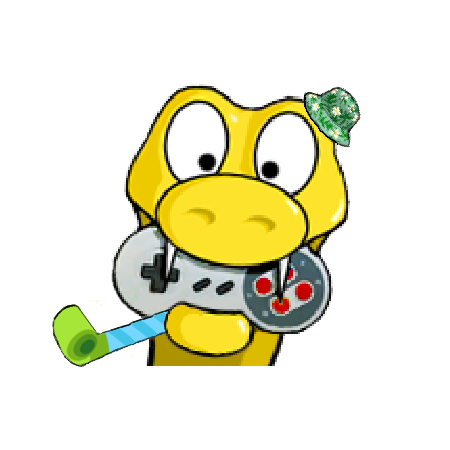

<!-- PROJECT LOGO -->
<br />
<div align="center">
  <a href="https://github.com/AchrafYndz/Camel-Palestine">
    
  </a>

<h3 align="center">Camel Palestine</h3>
  <p align="center">
    2D Platformer Game
    <br />
    <a href="https://github.com/AchrafYndz/Camel-Palestine/issues">Report Bug</a>
    ·
    <a href="https://github.com/AchrafYndz/Camel-Palestine/issues">Request Feature</a>
  </p>
</div>


<!-- TABLE OF CONTENTS -->
<details>
  <summary>Table of Contents</summary>
  <ol>
    <li>
      <a href="#about-the-project">About The Project</a>
      <ul>
        <li><a href="#built-with">Built With</a></li>
      </ul>
    </li>
    <li>
      <a href="#getting-started">Getting Started</a>
      <ul>
        <li><a href="#prerequisites">Prerequisites</a></li>
        <li><a href="#installation">Installation</a></li>
      </ul>
    </li>
    <li><a href="#gameplay">Gameplay</a></li>
    <li><a href="#contributing">Contributing</a></li>
    <li><a href="#license">License</a></li>
    <li><a href="#acknowledgments">Acknowledgments</a></li>
  </ol>
</details>


<!-- ABOUT THE PROJECT -->

## About The Project

 <center> </center>

<p align="right">(<a href="#readme-top">back to top</a>)</p>

### Built With

- Python 
- PyGame 
- Tiled 
- Aseprite 

<p align="right">(<a href="#readme-top">back to top</a>)</p>


<!-- GETTING STARTED -->

## Getting Started

### Prerequisites

* [Python 3](https://www.python.org/downloads/)
* PyGame
  ```sh
    pip install pygame 
  ```

### Installation

1. Clone the repo
   ```sh
    git clone https://github.com/AchrafYndz/Camel-Palestine.git
   ```
2. Change directory to the code folder
   ```sh
    cd code
   ```
3. Run the code
   ```sh
    python3 main.py
   ```
   or
   ```sh
    python main.py
   ```

Alternatively, if you're on Windows, simply run the prebuilt `main.exe` file that can be found in `dist/`.

<p align="right">(<a href="#readme-top">back to top</a>)</p>

## Gameplay

### Controls

#### In-game

<kbd>w</kbd> or <kbd>&#8593;</kbd>: jump

<kbd>a</kbd> or <kbd>&#8592;</kbd>: move left

<kbd>d</kbd> or <kbd>&#8594;</kbd>: move right

#### Menu

<kbd>a</kbd> or <kbd>&#8592;</kbd>: previous level

<kbd>d</kbd> or <kbd>&#8594;</kbd>: next level

<kbd>Enter</kbd> or <kbd>Spacebar</kbd>: select

<p align="right">(<a href="#readme-top">back to top</a>)</p>

<!-- CONTRIBUTING -->

## Contributing

Contributions are what make the open source community such an amazing place to learn, inspire, and create. Any
contributions you make are **greatly appreciated**.

If you have a suggestion that would make this better, please fork the repo and create a pull request. You can also
simply open an issue with the tag "enhancement". Don't forget to give the project a star!

1. Fork the Project
2. Create your Feature Branch (`git checkout -b feature/AmazingFeature`)
3. Commit your Changes (`git commit -m 'Add some AmazingFeature'`)
4. Push to the Branch (`git push origin feature/AmazingFeature`)
5. Open a Pull Request

<p align="right">(<a href="#readme-top">back to top</a>)</p>


<!-- LICENSE -->

## License

Distributed under the Creative Commons Attribution-NonCommercial-NoDerivatives 4.0 International License.
See `LICENSE.md` for more information.

<p align="right">(<a href="#readme-top">back to top</a>)</p>


<!-- ACKNOWLEDGMENTS -->

## Acknowledgments

* [Clear Code's series on how to make a platformer game in PyGame](https://youtube.com/playlist?list=PL8ui5HK3oSiGXM2Pc2DahNu1xXBf7WQh-)

<p align="right">(<a href="#readme-top">back to top</a>)</p>


<!-- MARKDOWN LINKS & IMAGES -->
<!-- https://www.markdownguide.org/basic-syntax/#reference-style-links -->

[contributors-shield]: https://img.shields.io/github/contributors/AchrafYndz/Camel-Palestine.svg?style=for-the-badge

[contributors-url]: https://github.com/AchrafYndz/Camel-Palestine/graphs/contributors

[forks-shield]: https://img.shields.io/github/forks/AchrafYndz/Camel-Palestine.svg?style=for-the-badge

[forks-url]: https://github.com/AchrafYndz/Camel-Palestine/network/members

[stars-shield]: https://img.shields.io/github/stars/AchrafYndz/Camel-Palestine.svg?style=for-the-badge

[stars-url]: https://github.com/AchrafYndz/Camel-Palestine/stargazers

[issues-shield]: https://img.shields.io/github/issues/AchrafYndz/Camel-Palestine.svg?style=for-the-badge

[issues-url]: https://github.com/AchrafYndz/Camel-Palestine/issues

[license-shield]: https://img.shields.io/github/license/AchrafYndz/Camel-Palestine.svg?style=for-the-badge